# BDA Fishing

BDA Fishing website is for people that want to fish, shop or relax around the lakes and rivers the club manages.

Users of the site will instantly be aware on the page opening up, what they are looking for with a simple and easy layout to navigate pages. it has 3 sections aimed at providing users with BDA Fishing information, the community who fish and use the waters, and how anyone can leave their details for a club member to contact them to provide legendary customer service.

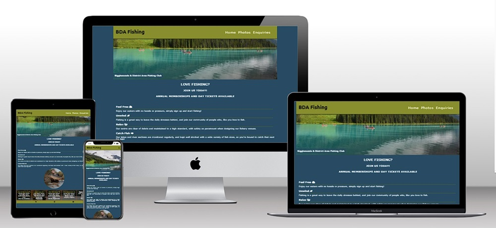 

## Features

* Favicon
  - using the site [Favomatic](https://favicomatic.com/) I was able to make my own Favicon from a cropped picture I sourced from [pexels.com](https://www.pexels.com/) 

* Navigation Bar
    - always in the top right corner on the screen, and has 2 styles depending on real-estate size.
    - Smaller screens, the navigation can be accessed to the top right of the screen by tapping the burger Icon and the page links appear below in a toggled menu.
    - On larger screen sizes over 768px the links appear in the header neatly displayed in a column to the left of the screen.
    - The main club text is also a home page link back to the index page.

* The Header
    - Shown at the top of all three pages, and each page having an identical theme.
    - The header sits at the top of all three pages, containing the Nav links in the format described above.
    - The Club has no logo, but uses Google fonts, to style a H1 heading to give it a better look.

 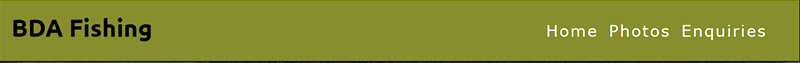 

 * The Home page

    - This is the landing page, with a stunning view of the lake overlooking the boats it’s sure to get any angler wanting to join!

    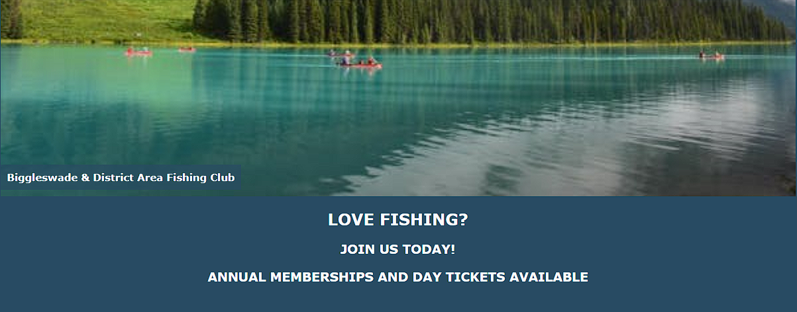 

    - This section below shows very simply how and what the club offers and the benefits of fishing, 
    - Including one of the clubs star catches, demonstrating a typical fish size on one of the waters, offering the potential new member or day ticket holder the chance and wonder of netting an exciting opportunity!
    - The bottom of this section shows the venues available to fish and the shop. The shop wording is in white so it stands out, and creates a visual aid when linked to from the enquiries/signup page. 

       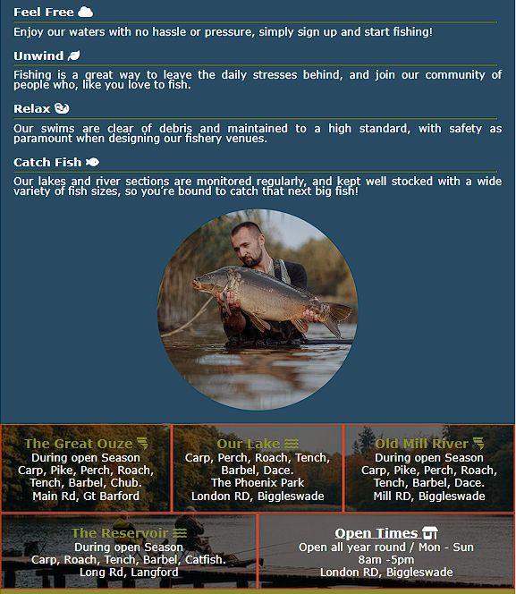 

* The Footer

    - This section has relevant links to Facebook, Instagram and You Tube.
    - The links open in a new browser tab, and allow the user to interact with the club community and watch related content.

   

* The Photos Page

    - The photos page is there for the club to post key photos that help the potential member gain a real world experience in what to expect.
    - The page also helps the existing members display their accomplishments, and something to be proud of!
    - No writing was used in this page, to keep the page true to its intended purpose.
    - Pictures are responsive on different sizes depending on the available real-estate.

    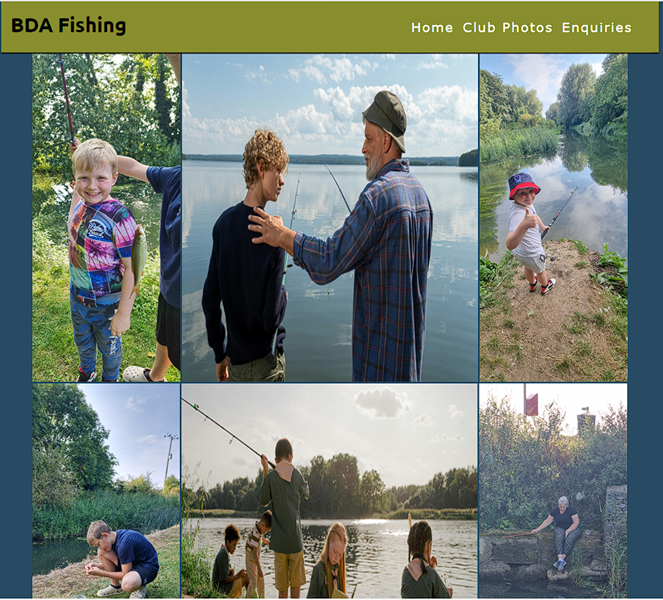 

* The Enquiries / Signup Page

  - In this section are two easy to read and short text explanations with the main text separated from the form to fill out, to give a simple focus to the page.
  - The form contains placeholder text, giving an example of what data the user should input.
  - Both sections are basic with no distractions, it is clear on what the user is expected to do, if they are interested in taking their interest to the next level in becoming a member, and joining the club.

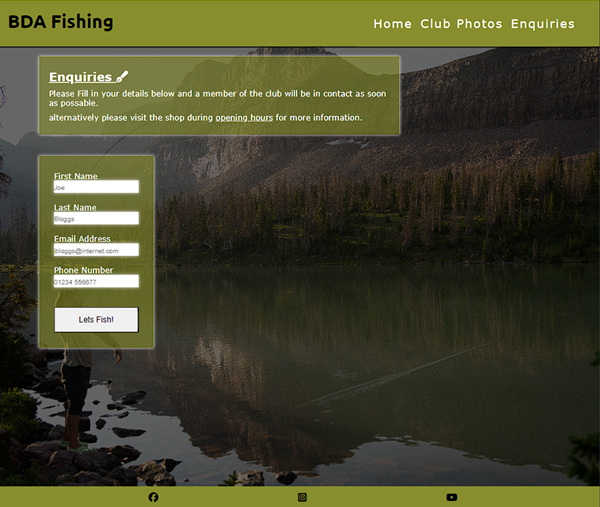 

### Features left to implement

 - I would love to add maps of the waters to aid in the allure of joining the club and assist members in finding the right spot.
 - I would also like to add another page for a club shop, selling bait and tackle and club merchandise online, including new memberships with an online pay section.
 - Finally a sign in member’s area where members can sign in and access their profile, Specific Venue details like gate codes and a booking section to regulate how many anglers can fish at one time, to protect the fish. This area would also have a news or updates section to keep members up-to-date with club news.

## Testing

I ran my page through Lighthouse to ensure my site is easy to read and nicely accessible.

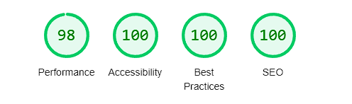 

- I tested my site on Chrome, Safari and Firefox, and it works well on these browsers.
- I tested all links on pages to make sure they were working.
- I tested all external links to make sure they work, and link in a separate tab to the correct site.
- I tested that the form works, and submits the all the information correctly.

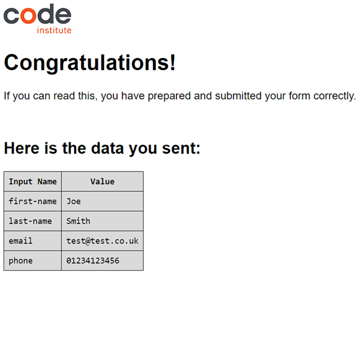 

* HTML 
  - I ran the code through the checker and found 1 concern regarding the Phone number field on the Enquiries page, that some browsers might not support this function.
  - The concern was addressed by placing * next to the name and email labels, and putting a key at the bottom.
  - I also researched the type="tel" on [w3schools](https://www.w3schools.com/tags/att_input_type_tel.asp) which showed the following browsers that support it, and felt confident the risk was very low.

  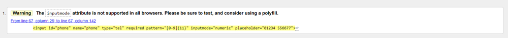
  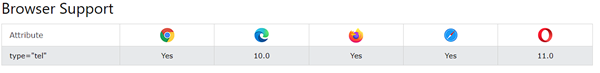 

 
* CSS
  - No errors were found when the code was run through the CSS validation service. 

  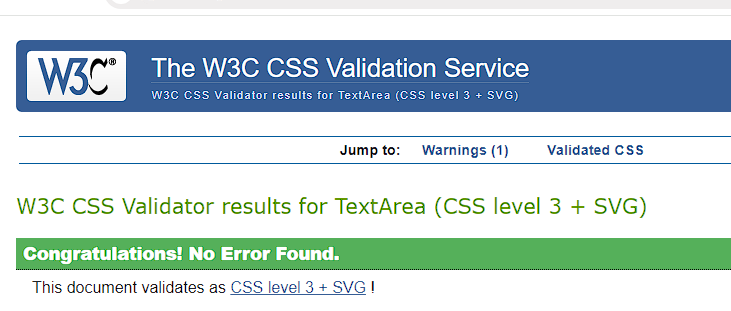

## Bugs
  - being my first page, there were a few bugs, and "opportunities to learn" along the way, which I spent time researching and spoke to tutor support for help and advice a couple of times. but to name a couple of my bigger issues,
  - getting the pictures on the pictures page to fit together nicely was a challenge, but after speaking with a tutor and my mentor I discovered that the picture sizes were very big, and needed scaling down, which I was able to do easily using the windows paint function, and using flex-box got them lined up nicely.
  - There were various minor errors that I was quickly able to discover, because I was running my code through both validation services at periodic points, and using the Google Developer Tools and correcting things using the correct heading tags in the expected places, and correctly spacing the content out.
  - The image for the sign up page was fixed, and not relative and did not load when deployed. This was an easy fix correcting the code and updating the repository with a bug fix update, upon discovering it.

## Deployment

* Version Control

  - The site was created using the Gitpod editor and pushed to the remote fishing club repository on Github.com
  - Git commands were used regularly during the construction of the club website using the following Git commands
  - git add .  - to add files to the staging area before being committed
  - git commit -m "commit title" - to commit a file to the queue ready for the final process.
  - git push - used to send the committed files to the Github repository.

* Deployment to Github pages

  - I used the following steps to deploy using the Github pages as follows
  - Once inside the repository, I clicked on the settings tab
  - I then went to the pages section
  - Making sure the main branch was selected I then clicked on save and the page URL was created.
  - Please click here to find the live site [BDA Fishing](https://rick-8.github.io/fishingclub/)

* Using Gitpod

  - To set up my working IDE I logged in to Gitpod and navigated to the workspaces section
  - Clicking on new workspace and in putting the repository URL, 
  - The IDE was created.

## Design - Wireframes

 - Making the site I used the mobile first method in developing. I used [wireframe](https://balsamiq.com/) to plot a general layout both on Mobile first and being responsive on bigger screens.

* Mobile screens from 280px
  - 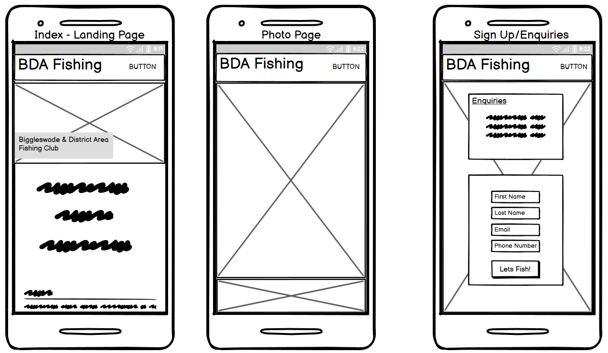

 * Larger screens with a min-width of 768px
  - 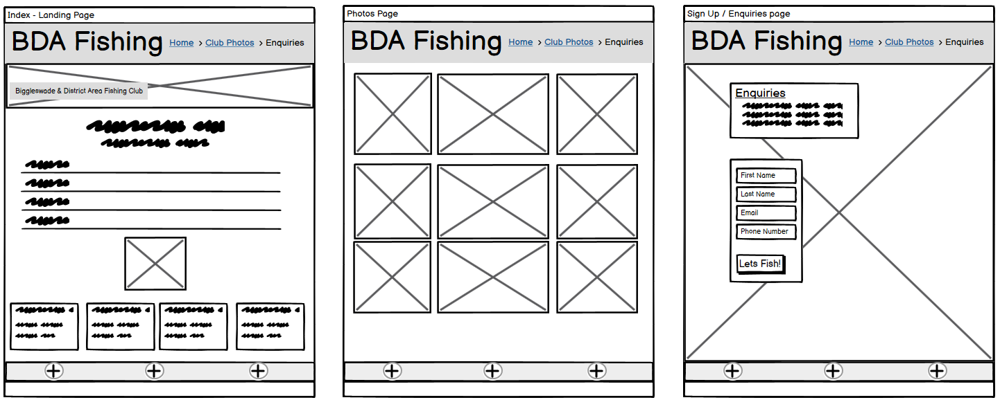

## Credits
- I would like give a special thank you to my mentor for his help and support.
- I would also like to credit the Love Running project walkthrough, for inspiration on the layout of the header, footer and basic page design.

### Content
 - The Icons in the header, footer and on some heading titles were imported from [Font Awesome](https://fontawesome.com/)
 - The social media links in the footer, are the real logos from You Tube, Facebook and Instagram.
 - The favicon used for this website was created from a Picture of a float in the water taken from [pexels.com](https://www.pexels.com/) it was then, Cropped and uploaded to [favomatic](https://favicomatic.com/) website, which made me a full free set. This was then uploaded to gitpod, and implemented into my project.
